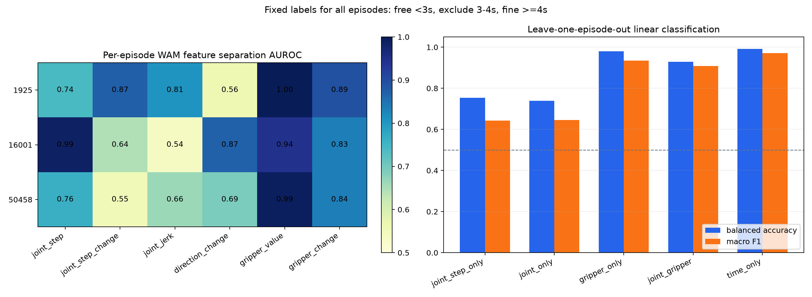

# WAM 动作序列区分 free / fine 的三轨迹快速实验

## 1. 要回答的问题

师兄的想法可以先简化为：只看 WAM 连续输出的 action sequence，能否判断机器人当前处于：

- `free`：远距离、相对简单的大范围移动；
- `fine`：靠近物体后，需要对准、接触、抓取或放置的精细操作。

本实验只做快速可行性检查，不讨论 early exit，也不设计动态算力策略。

## 2. 本轮直接结论

在这三条抓取放置轨迹上，WAM action tensor 中确实存在一致的 `free / fine` 信号：

- `free` 阶段的关节单步移动量更大；
- `fine` 阶段的关节运动整体更慢；
- `fine` 阶段的方向修正通常更多；
- `fine` 阶段的夹爪值和夹爪变化明显增大。

因此，初步规律不是“变化越大越困难”，而更接近：

```text
free：关节移动快、单步距离大、夹爪基本不动
fine：关节移动慢、方向修正增加、夹爪开始闭合或调整
```

但目前还不能得出“可以普遍可靠识别”的结论，因为三条视频都使用了几乎相同的时间边界，`time-only` 基线也接近满分。

## 3. 数据与人工标签

使用已有 WAM 推理结果中的三条 DROID 轨迹：

| Episode | 任务 |
|---:|---|
| 1925 | 将盘子中的黄色袋子放入右侧纸杯 |
| 16001 | 将黑色遥控器放到红色碗上 |
| 50458 | 从灰色杯子取出马克笔并放到桌面 |

用户观看视频后给出了同一个粗粒度划分：

```text
0～3 秒：free
3～4 秒：过渡区，不参与评分
4 秒以后：fine
```

视频为 15 FPS，因此对应：

```text
第 0～44 帧：free
第 45～59 帧：排除
第 60 帧以后：fine
```

WAM 现有预测覆盖第 23～190 帧。去掉每个 chunk 开头无法稳定计算高阶差分的 3 个点后，每条轨迹用于统计的数据为：

- free：19 个 action step；
- fine：116 个 action step。

三条轨迹合计 405 个 action step，其中 free 57 个、fine 348 个。

## 4. 分析的 tensor 与特征

WAM 每个 chunk 输出形状为：

```text
[24, 8] = 24 个动作 ×（7 个关节位置 + 1 个夹爪值）
```

只计算六个简单特征：

| 特征 | 含义 |
|---|---|
| `joint_step` | 相邻两个动作的 7 维关节位置差的范数 |
| `joint_step_change` | 关节步长的一阶变化，近似加速度信息 |
| `joint_jerk` | 更高阶的动作变化 |
| `direction_change` | 相邻运动方向的夹角变化 |
| `gripper_value` | WAM 输出的夹爪位置值 |
| `gripper_change` | 相邻动作的夹爪变化量 |

不同关节的数值范围不同，因此关节差分先除以训练集中的关节有效范围。所有差分只在同一个 24-step chunk 内计算，绝不把两个独立生成的 chunk 直接相减。

## 5. 单特征结果

下表全部是 WAM 预测动作。`AUROC` 越接近 1，表示该单特征越能将两段分开；这里只表示同一条轨迹内的可分性，不代表跨任务泛化。

| Episode | free 关节步长 | fine 关节步长 | 关节步长 AUROC | 步长变化 AUROC | 方向变化 AUROC | 夹爪值 AUROC | 夹爪变化 AUROC |
|---:|---:|---:|---:|---:|---:|---:|---:|
| 1925 | 0.0160 | 0.0086 | 0.741 | 0.872 | 0.560 | 1.000 | 0.893 |
| 16001 | 0.0198 | 0.0080 | 0.987 | 0.643 | 0.871 | 0.945 | 0.835 |
| 50458 | 0.0149 | 0.0114 | 0.760 | 0.552 | 0.692 | 0.991 | 0.836 |

三条轨迹方向完全一致：

- 关节单步移动量在 fine 阶段全部下降；
- 关节步长变化在 fine 阶段全部下降，但 episode 50458 上区分较弱；
- 方向变化在 fine 阶段全部上升；
- 夹爪值与夹爪变化在 fine 阶段全部上升。



## 6. 跨轨迹测试

为了避免在同一条轨迹上同时训练和测试，使用 leave-one-episode-out：每次用两条轨迹训练一个带类别平衡的线性逻辑回归，在完全没见过的第三条轨迹上测试，最后汇总三次预测。

| 输入特征 | AUROC | Balanced Accuracy | Macro-F1 |
|---|---:|---:|---:|
| 仅关节步长 | 0.802 | 0.754 | 0.643 |
| 全部关节动态 | 0.787 | 0.739 | 0.646 |
| 仅夹爪 | 0.977 | 0.980 | 0.935 |
| 关节 + 夹爪 | 0.976 | 0.929 | 0.908 |
| 仅视频时间 | 1.000 | 0.991 | 0.971 |

从这组数字可以得到两层结论：

1. 只看关节动态已经有中等强度的区分能力，但远未达到可靠使用的程度。
2. 夹爪特征非常强，但它主要识别的是“夹爪打开 / 闭合 / 正在变化”，不等价于真正理解机械臂与物体的距离。

## 7. 为什么不能直接宣布验证成功

### 7.1 时间偏差

三条轨迹都被标为前三秒 free、四秒后 fine。因此模型只看当前视频播放到第几秒，也能几乎完美分类。当前实验无法排除以下情况：

```text
WAM 的动作模式只是随任务进度规律变化，
而不是动作 tensor 真正包含可泛化的“难度”。
```

### 7.2 free 样本太少

现有 WAM 预测从第 23 帧开始，且每条视频的 free 段只剩 19 个稳定 action step，基本集中在第一个 chunk。统计中的相邻 step 也高度相关，不能当成 405 个独立样本理解。

### 7.3 标签仍然很粗

“4 秒以后全部算 fine”会把抓稳物体后的稳定搬运也算作 fine。但稳定搬运可能重新变成简单运动。因此本轮只验证了“初始自由移动 vs 后续操作阶段”，还没有验证一条轨迹中反复出现的：

```text
简单 → 困难 → 简单 → 困难
```

## 8. 对师兄问题的当前回答

目前可以回答：

> WAM 输出的动作序列中确实含有可用于粗分 free / fine 的信号。三条轨迹均表现为 free 阶段关节动作更快，fine 阶段关节减速、方向修正和夹爪活动增加。因此“根据输出动作序列判断阶段”值得继续验证，但不能简单使用“参数变化越大越困难”的规则。

目前不能回答：

> 尚未证明该规律能跨越不同阶段时刻、不同任务和多次简单/困难切换稳定成立，也尚未证明仅凭 action tensor 可以判断机械臂与目标物体的真实空间距离。

## 9. 下一轮最小验证

不需要设计复杂标注系统。下一轮只需增加 8～10 条阶段时刻不同的视频，每条仍然只标：

```text
free 结束的大致秒数
fine 开始的大致秒数
```

然后重复相同分析，并重点比较：

- `action-only` 是否仍能在未见轨迹上区分；
- `action-only` 是否明显优于 `time-only`；
- 不使用夹爪时，纯关节特征是否仍保持稳定方向。

只有当阶段发生时刻不一致时，action 特征仍稳定超过 time-only，才算真正支持师兄的想法。

## 10. 结果文件

- 单轨迹分析脚本：`research/action_phase_segmentation/src/quick_user_boundary_test.py`
- 三轨迹汇总脚本：`research/action_phase_segmentation/src/summarize_quick_boundary_tests.py`
- Episode 1925 曲线：`research/action_phase_segmentation/pilot/user_boundary_1925/timeseries.png`
- Episode 16001 曲线：`research/action_phase_segmentation/pilot/user_boundary_16001/timeseries.png`
- Episode 50458 曲线：`research/action_phase_segmentation/pilot/user_boundary_50458/timeseries.png`
- 三轨迹汇总指标：`research/action_phase_segmentation/pilot/user_boundary_summary/`

