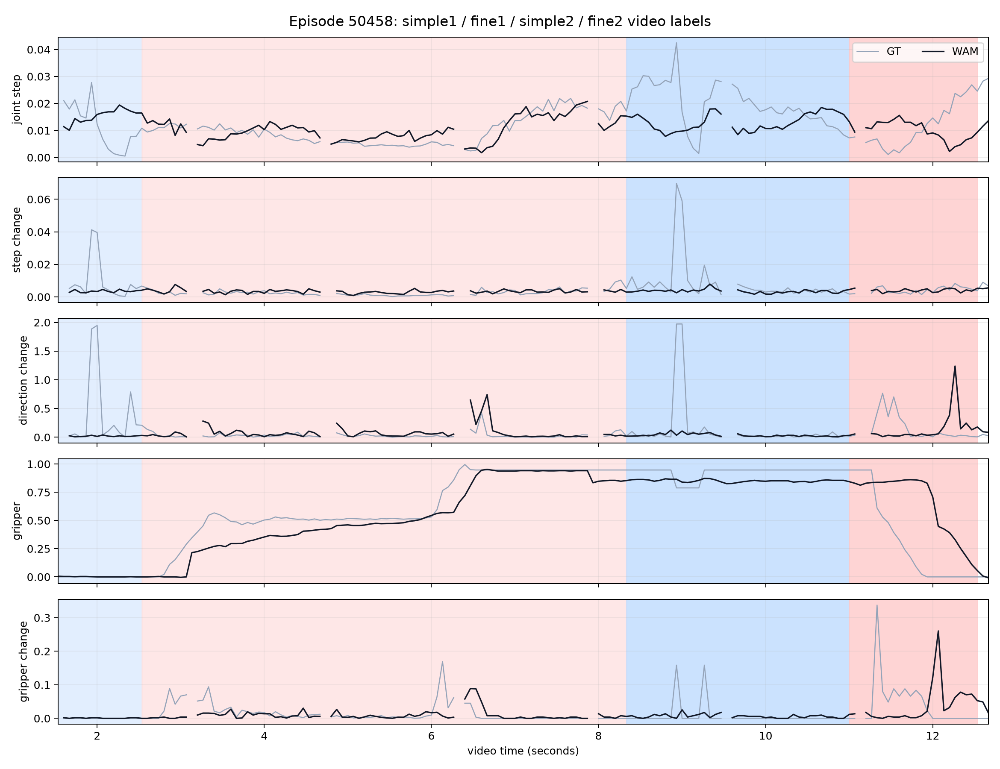

# Episode 50458 多阶段 simple / fine 重新验证

## 1. 为什么重新做

此前把视频统一切成“0～3 秒 free、4 秒以后 fine”，会把抓稳物体后的稳定搬运也错误标成 fine，而且时间本身就能猜中标签。

Episode 50458 包含一条更有价值的阶段序列：

```text
简单移动 → 精细抓取 → 简单搬运 → 精细放置
```

本实验只验证 WAM 输出的 action tensor 能否跟随这两次难度切换，不涉及 early exit 或动态计算。

## 2. 固定的视频标签

标签先根据三视角视频确定，再分析 action tensor：

| 阶段 | 时间 | 帧范围 | 标签 |
|---|---:|---:|---|
| `simple_1` | 0～2.53 秒 | 0～37 | 大范围移动到杯子附近 |
| `fine_1` | 2.53～8.33 秒 | 38～124 | 对准、接触、抓取并抽出马克笔 |
| `simple_2` | 8.33～11.00 秒 | 125～164 | 抓稳后搬向放置区域 |
| `fine_2` | 11.00～12.53 秒 | 165～187 | 对准桌面、放置并释放 |

视频为 15 FPS。WAM 现有预测覆盖第 23～190 帧，所以第一段 simple 实际只覆盖后半部分。每个独立 24-step chunk 的开头 3 个点被排除，避免跨 chunk 或高阶差分未定义造成假信号。

最终有效 action step 数：

| 阶段 | 有效 step |
|---|---:|
| `simple_1` | 12 |
| `fine_1` | 75 |
| `simple_2` | 37 |
| `fine_2` | 20 |

## 3. WAM 四阶段特征

| 阶段 | 关节步长 | 步长变化 | 方向变化 | 夹爪值 | 夹爪变化 |
|---|---:|---:|---:|---:|---:|
| `simple_1` | 0.0160 | 0.0035 | 0.0199 | 0.0011 | 0.0010 |
| `fine_1` | 0.0107 | 0.0033 | 0.0657 | 0.5314 | 0.0076 |
| `simple_2` | 0.0132 | 0.0035 | 0.0358 | 0.8533 | 0.0064 |
| `fine_2` | 0.0100 | 0.0040 | 0.1438 | 0.6500 | 0.0401 |

两轮切换中重复出现的规律是：

- 关节步长：fine 阶段均下降；
- 方向变化：fine 阶段均上升；
- 夹爪变化量：fine 阶段均上升；
- 关节高阶变化没有稳定方向。

具体变化：

```text
第一轮：关节步长 0.0160 → 0.0107，下降约 33%
第二轮：关节步长 0.0132 → 0.0100，下降约 24%

第一轮：方向变化 0.0199 → 0.0657，约 3.3 倍
第二轮：方向变化 0.0358 → 0.1438，约 4.0 倍
```



图中蓝色为 simple，红色为 fine；灰线是数据集真实动作，黑线是 WAM 预测动作。

## 4. 跨周期检验

只在一个周期上学习一个线性阈值，再到另一个周期测试。这样可以检验模型识别的是动作模式，还是仅仅记住某一段时间。

### 第一次抓取周期训练，第二次放置周期测试

| 输入 | AUROC | Balanced Accuracy | Macro-F1 |
|---|---:|---:|---:|
| 仅关节步长 | 0.716 | 0.666 | 0.596 |
| 全部关节动态 | 0.708 | 0.641 | 0.579 |
| 仅夹爪 | 0.586 | 0.500 | 0.260 |
| 关节 + 夹爪 | 0.746 | 0.500 | 0.260 |
| 仅时间 | 1.000 | 0.500 | 0.260 |

### 第二次放置周期训练，第一次抓取周期测试

| 输入 | AUROC | Balanced Accuracy | Macro-F1 |
|---|---:|---:|---:|
| 仅关节步长 | 0.877 | 0.813 | 0.616 |
| 全部关节动态 | 0.821 | 0.780 | 0.570 |
| 仅夹爪 | 0.072 | 0.347 | 0.374 |
| 关节 + 夹爪 | 0.108 | 0.353 | 0.379 |
| 仅时间 | 1.000 | 0.500 | 0.121 |

这里 `time-only` 的 AUROC 仍为 1，是因为每个周期内部都是 simple 在前、fine 在后；但是从一个周期学到的固定时间阈值在另一个周期全部失效，因此 Balanced Accuracy 只有 0.5。

## 5. 关键发现

### 5.1 关节步长是目前最可信的简单信号

一个只看关节步长的线性阈值，跨周期平均：

```text
AUROC ≈ 0.797
Balanced Accuracy ≈ 0.740
```

这说明 WAM 预测动作中的“进入精细操作后减速”不只是第一次抓取阶段的偶然现象，在后面的放置阶段也再次出现。

### 5.2 夹爪状态不是可靠的难度指标

第一次抓取时：

```text
simple_1：夹爪打开
fine_1：夹爪开始闭合
```

但第二次切换时：

```text
simple_2：稳定搬运，夹爪保持闭合
fine_2：放置和释放，夹爪逐渐打开
```

因此“夹爪闭合 = fine”会直接把稳定搬运误判为困难。夹爪值更适合表示操作状态，不适合单独表示难度。夹爪的变化量比夹爪绝对值更合理，但仍需更多轨迹验证。

### 5.3 变化越大越困难仍然不成立

两轮 fine 阶段最稳定的特征是关节移动变慢，而不是加速度或 jerk 一定增大。更合理的候选规则是：

```text
较小的关节步长
+ 较多的方向修正
+ 夹爪正在变化
= 更可能处于精细操作
```

## 6. 当前结论

这次实验比固定 3/4 秒切分更支持师兄的想法：

> 在同一条轨迹发生两次 simple → fine 切换时，WAM 输出都表现出关节减速和方向修正增加。仅使用关节步长的简单阈值可以部分迁移到另一次切换，平均平衡准确率约 0.74。

但它仍然只是一个 episode，第一段 simple 只有 12 个有效 step，边界也是视觉近似值。因此现在可以说“存在可重复信号”，还不能说“已经得到可靠难度检测器”。

## 7. 结果文件

- 实验脚本：`research/action_phase_segmentation/src/validate_episode_50458_multiphase.py`
- 时间曲线：`research/action_phase_segmentation/pilot/episode_50458_multiphase/timeline.png`
- 四阶段特征：`research/action_phase_segmentation/pilot/episode_50458_multiphase/segment_metrics.csv`
- 跨周期结果：`research/action_phase_segmentation/pilot/episode_50458_multiphase/cycle_transfer_metrics.csv`
- 完整逐步特征：`research/action_phase_segmentation/pilot/episode_50458_multiphase/per_step_features.csv`

